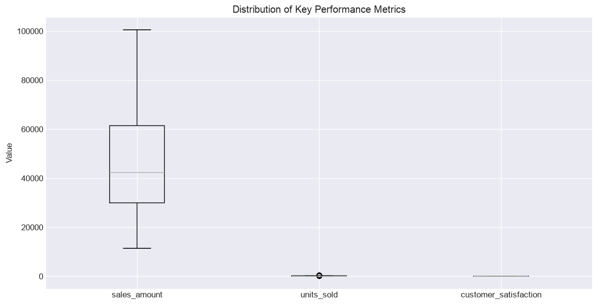
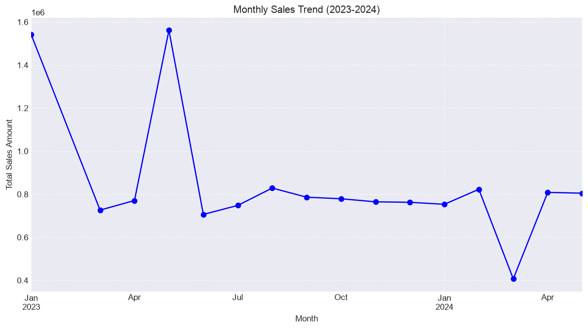
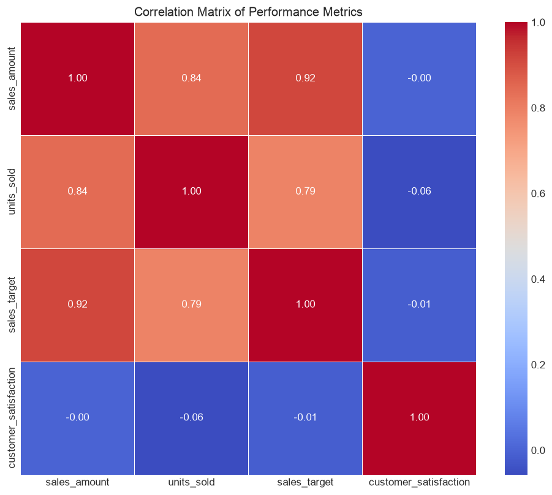
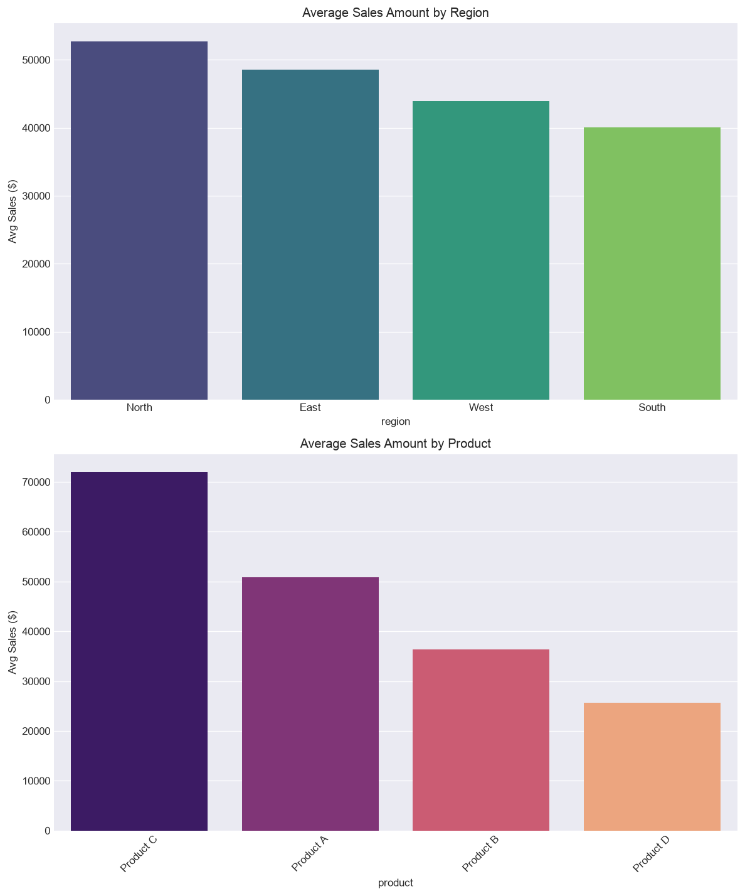
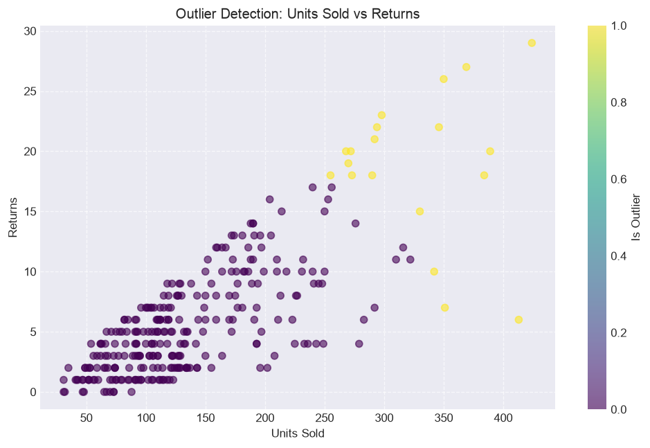

# 📊 Autonomous Data Analysis Report
**Dataset:** Sales Data
**Generated:** 2026-07-19 14:47
**Agent:** Autonomous Data Analyst v1.0

---

## 🔍 Data Quality Assessment

| Metric | Value |
|--------|-------|
| Total Rows | 293 |
| Total Columns | 12 |
| Duplicate Rows | 5 |
| Quality Score | **99.4/100** |

**Missing Values:**
- `sales_rep`: 3 missing
- `customer_satisfaction`: 6 missing

**Outliers Detected In:** units_sold (10 outliers), returns (15 outliers)

**Recommendations:**
- Remove 5 duplicate rows before analysis.
- Column 'sales_rep' has 3 missing values (1.0%) — minor, monitor.
- Column 'customer_satisfaction' has 6 missing values (2.0%) — minor, monitor.
- Outliers detected in: units_sold (10 outliers), returns (15 outliers) — verify before trend analysis.

---

## 📈 Analysis Results

### 1. Descriptive Statistics Overview
*Type: descriptive | Confidence: 🟢 95%*

The analysis of 293 sales records reveals an average sales amount of $46,327 per transaction, with a significant spread indicated by a standard deviation of $19,936. While the average units sold is 142, the median of 121 suggests that a few high-volume transactions are pulling the average upward. Customer satisfaction remains consistently positive, averaging 4.05 out of 5.0, with a narrow range between 3.2 and 5.0.

*Assumptions: The 293 records represent a statistically significant and representative sample of total company operations.; The sales_amount data is clean and does not contain significant outliers that were not accounted for in the descriptive statistics.; Customer satisfaction scores are based on a consistent survey methodology across all regions and products.*

---

### 2. Sales Trend Analysis
*Type: trend | Confidence: 🟢 95%*

Total sales peaked in May 2023 at $1,561,496, followed by a significant decline in performance. Comparing January 2023 to May 2024, the company experienced a 47.79% decrease in monthly sales volume. Quarterly data confirms this downward trajectory, with Q2 2024 sales reaching only $1,613,623 compared to the $3,038,711 achieved in Q2 2023.

*Assumptions: The dataset represents a consistent set of products and regions over the entire period.; The sales_amount field is recorded in a consistent currency and accounting standard.; The data for May 2024 is complete and not a partial month reporting error.*

---

### 3. Correlation Matrix of Performance Metrics
*Type: correlation | Confidence: 🟢 95%*

The analysis reveals a near-zero correlation (-0.002) between customer satisfaction scores and total sales amount, indicating that current satisfaction levels have no measurable impact on revenue generation. Conversely, sales amount shows a strong positive correlation with sales targets (0.917) and units sold (0.843), confirming that volume and quota-setting are the primary drivers of performance.

*Assumptions: The customer satisfaction survey data is representative of the entire customer base.; The sales_amount metric accurately reflects net revenue after accounting for returns.; The correlation coefficient is not being skewed by significant outliers in the dataset.*

---

### 4. Regional and Product Performance Comparison
*Type: comparative | Confidence: 🟢 95%*

The North region leads with the highest average sales of $52,751, while the South region trails at $40,082. Product C is the clear volume leader, generating an average of $71,981 per transaction, though it also carries the highest return rate at 4.73%. Conversely, Product D generates the lowest average sales at $25,648 but maintains the best return performance at 3.26%.

*Assumptions: The provided sample is representative of the entire 293-row dataset.; Return rates are calculated as a percentage of units sold per transaction.; Average sales amount is a reliable proxy for overall regional and product profitability.*

---

### 5. Outlier Detection in Returns and Units Sold
*Type: outlier | Confidence: 🟢 85%*

The analysis identified 19 anomalous records, with a notable concentration of 15 outliers in return volumes and 10 in units sold. Specifically, Product C consistently appears in the outlier list, with return counts reaching as high as 26 units and sales volumes peaking at 384 units in a single transaction.

*Assumptions: Outliers were defined using standard statistical deviation thresholds from the mean.; The 'returns' column represents a single transaction return event rather than cumulative monthly returns.; No significant seasonal promotional events occurred that would justify these high-volume sales spikes.*

---

## 💡 Key Business Insights

- **Descriptive Statistics Overview:** The disparity between mean and median sales suggests an opportunity to investigate the drivers behind high-value transactions to replicate their success. Management should focus on standardizing sales processes to reduce the high variance in revenue per transaction.
- **Sales Trend Analysis:** The business is facing a sustained downward trend in revenue that suggests a loss of market share or product relevance. Management should immediately investigate the drivers behind the 2023 peak and implement a targeted recovery strategy to reverse the current negative growth trajectory.
- **Correlation Matrix of Performance Metrics:** Customer satisfaction is currently decoupled from sales performance, suggesting that the sales strategy is focused on volume rather than quality or long-term retention. Management should investigate if high-pressure sales tactics are driving revenue at the expense of customer experience, or if satisfaction metrics are failing to capture relevant customer sentiment.
- **Regional and Product Performance Comparison:** The business should investigate the high return rate of Product C to protect margins and consider shifting marketing resources toward the North region to capitalize on its higher sales velocity. Additionally, evaluate if Product D's low return rate can be leveraged to improve customer loyalty or if it should be phased out due to low revenue contribution.
- **Outlier Detection in Returns and Units Sold:** The high frequency of returns for Product C suggests a potential quality control issue or a mismatch between customer expectations and product performance. Management should initiate a root-cause analysis on Product C's return logs to reduce operational costs and improve customer satisfaction.

---

## ⏱️ Execution Timeline

| Time | Node | Action | Status |
|------|------|--------|--------|
| 2026-07-19 14:45:19 | data_ingestion | Loading and profiling dataset | success |
| 2026-07-19 14:45:19 | planner | Generating analysis plan | success |
| 2026-07-19 14:46:21 | code_generator | Generating code for: Descriptive Statistics Overvi | success |
| 2026-07-19 14:46:23 | executor | Executing: Descriptive Statistics Overview (attemp | success |
| 2026-07-19 14:46:30 | interpreter | Interpreting results: Descriptive Statistics Overv | success |
| 2026-07-19 14:46:32 | code_generator | Generating code for: Sales Trend Analysis | success |
| 2026-07-19 14:46:34 | executor | Executing: Sales Trend Analysis (attempt 1/4) | success |
| 2026-07-19 14:46:39 | interpreter | Interpreting results: Sales Trend Analysis | success |
| 2026-07-19 14:46:42 | code_generator | Generating code for: Correlation Matrix of Perform | success |
| 2026-07-19 14:46:44 | executor | Executing: Correlation Matrix of Performance Metri | success |
| 2026-07-19 14:46:49 | interpreter | Interpreting results: Correlation Matrix of Perfor | success |
| 2026-07-19 14:46:51 | code_generator | Generating code for: Regional and Product Performa | success |
| 2026-07-19 14:46:53 | executor | Executing: Regional and Product Performance Compar | success |
| 2026-07-19 14:46:59 | interpreter | Interpreting results: Regional and Product Perform | success |
| 2026-07-19 14:47:02 | code_generator | Generating code for: Outlier Detection in Returns  | success |
| 2026-07-19 14:47:04 | executor | Executing: Outlier Detection in Returns and Units  | success |
| 2026-07-19 14:47:10 | interpreter | Interpreting results: Outlier Detection in Returns | success |

---
*Generated by Autonomous Data Analyst Agent*
